# Workflow Study Guide

A visual reference for understanding how Claude Code workflows are structured, how data flows between agents, and how the three project workflows apply these patterns.

---

## 1. The Core Primitives

Every workflow script is plain JavaScript that drives agents using five building blocks.

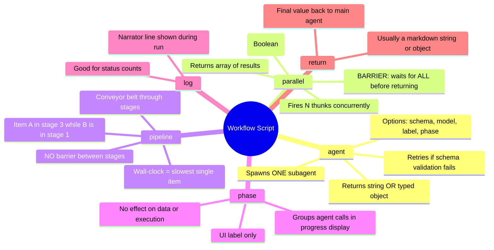

---

## 2. The `agent()` Call — Anatomy

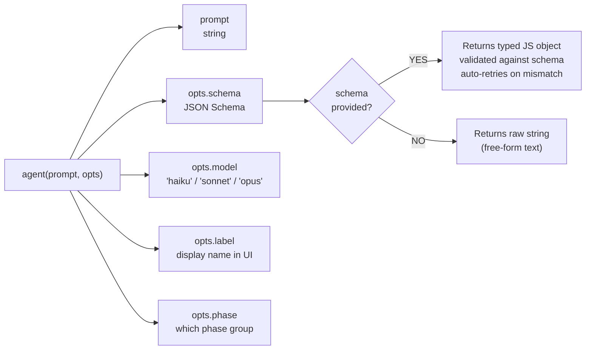

**The key insight:** schemas are the bridge between "agent outputs text" and "script works with data." Once you have a typed object back, you use plain JS to reshape it before passing it to the next agent.

---

## 3. `parallel()` vs `pipeline()` — When to Use Each

### `parallel()` — audit-macro domain reviews

Each thunk is one independent agent. All fire at once. Everything stops until the last one finishes (the barrier), because synthesis needs every domain's findings together.

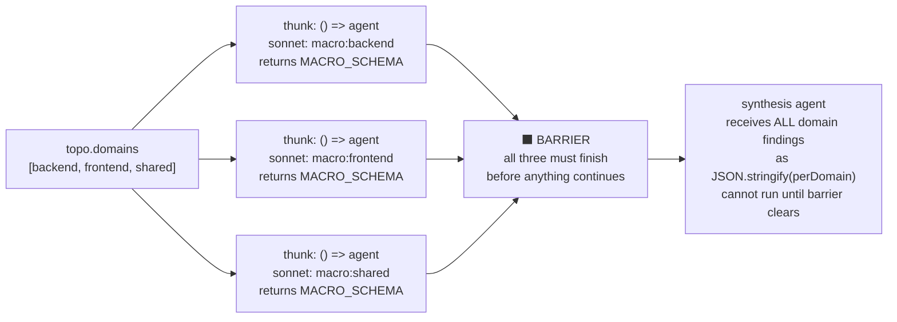

> One agent per thunk — not one agent shared across all thunks. `parallel([thunkA, thunkB, thunkC])` fires three separate agents. The array size determines how many agents spawn.

---

### `pipeline()` — audit-micro module audit + verify

Items are data (the module targets list from the scout). Stages are functions that receive an item and call `agent()`. The item travels through the functions — the functions spawn the agents. No barrier between stages: module B's audit starts the moment module A's audit returns, without waiting for A's verify to finish.

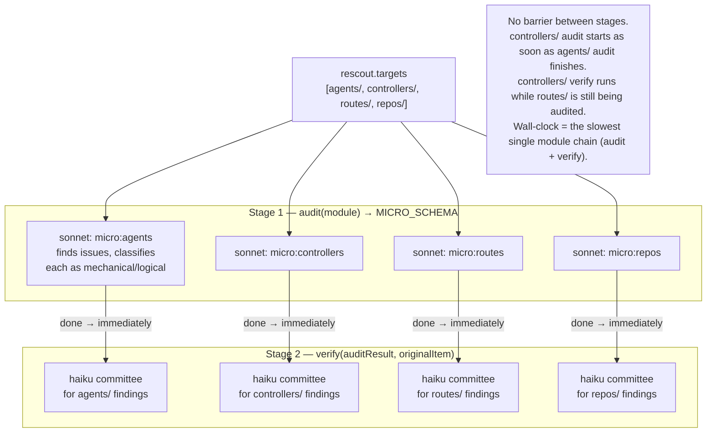

> **`parallel()` use case — audit-macro domain reviews**
> You have 4 domains to audit. You fire all 4 agents at once and wait for all of them to finish before the synthesis agent runs — because the synthesis agent needs *every* domain's findings in one shot to write the consolidated report. That's the barrier: synthesis can't start until the last domain finishes.

> **`pipeline()` use case — audit-micro audit + verify**
> You have 10 modules to audit. Each module has two stages: audit (find issues) then verify (committee vote). With `pipeline()`, module 2 starts its audit the moment module 1 finishes its audit — it doesn't wait for module 1's verify to finish. Module 1's verify and module 2's audit overlap in time. Wall-clock is the slowest single module chain, not the sum of all modules.

> **Is `pipeline()` just parallel under the hood?** Partly — yes. Items in a pipeline do run concurrently across stages. The difference is that `parallel()` is a hard sync point (everything stops until all thunks are done), while `pipeline()` has no such barrier between stages. Think of `parallel()` as a roundup ("everyone meet back here") and `pipeline()` as an assembly line ("each car moves to the next station as soon as it's ready, no waiting for the others").

> **¹ What is a thunk?** A thunk is just a zero-argument function used to *delay* a computation: `() => agent(...)`. Without it, `agent(...)` would fire the moment JavaScript evaluates the line — before `parallel()` even sees it. Wrapping it in `() =>` means the call only runs when `parallel()` explicitly invokes the function. This is how `parallel()` controls *when* and *how many* agents start at once (the concurrency cap is ~10 running at a time). See Section 4 for the full sequence diagram.

**Rule of thumb:** use `parallel()` only when the next step genuinely needs ALL prior results at once (e.g., deduplication across the full set). Otherwise `pipeline()` is faster and wastes less wall-clock time.

---

## 4. Thunks — Why `() => agent(...)` Not `agent(...)`

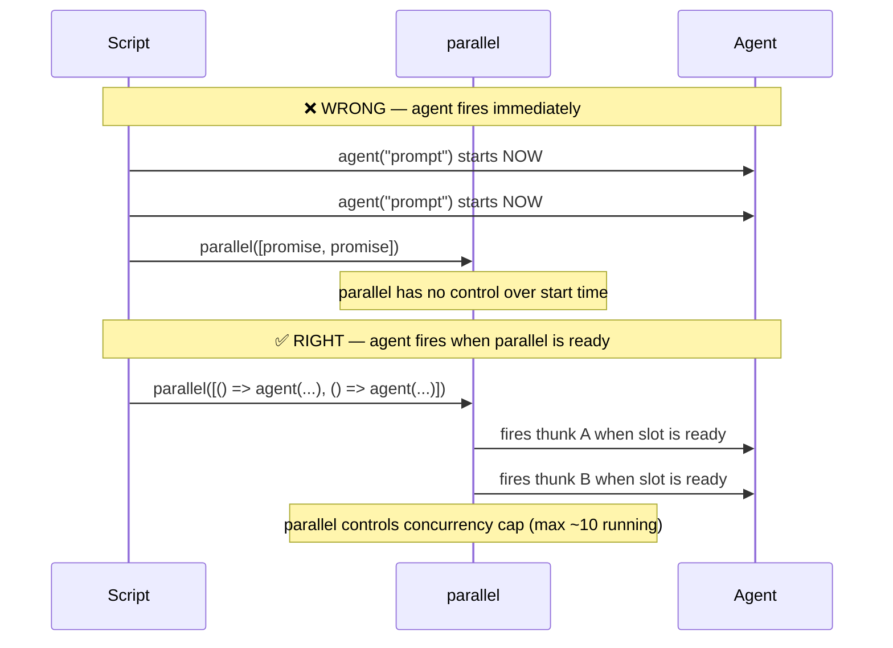

A thunk `() => agent(...)` is just a zero-arg function that delays execution. `parallel()` calls each thunk when a concurrency slot opens. Without thunks, all agents fire at once before `parallel()` can manage them.

---

## 5. How Data Flows — The Universal Pattern

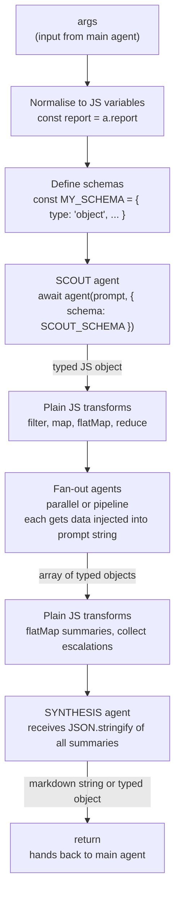

**The script is the memory.** Agents share no state. Data travels as:
1. Structured output from agent → JS variable
2. JS transforms the variable
3. Next agent receives it via `JSON.stringify(data)` injected into the prompt string

---

## 5.5 Fan-Out and Fan-In — The Shape, Not a Primitive

Fan-out/fan-in is not a separate mechanism from `parallel`/`pipeline`. It's the *shape* that emerges when you combine a structured scout output with those primitives.

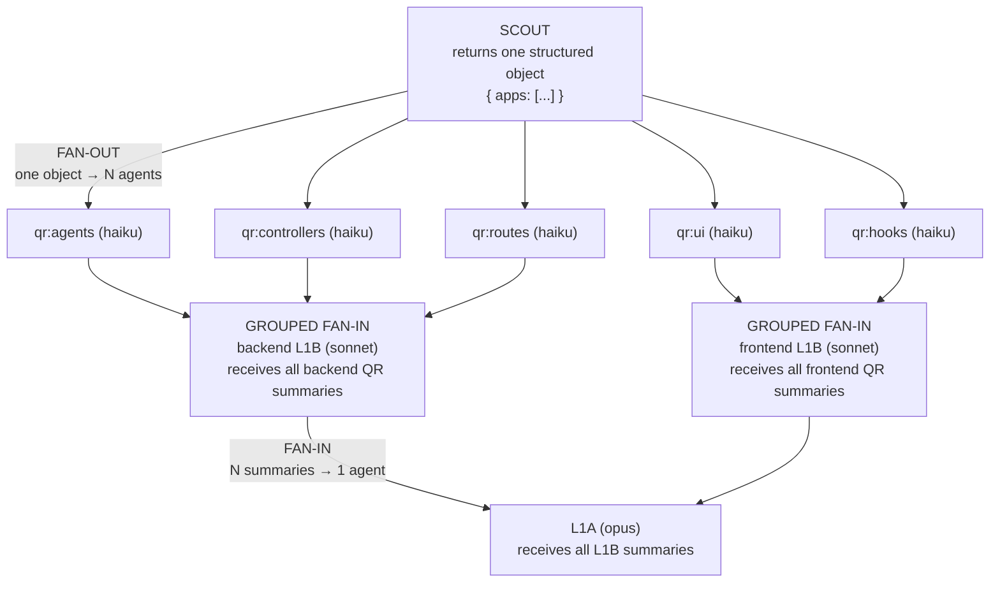

> **Fan-out** — one thing becomes many. The scout returns a work list; the script spawns one agent per item. One structured object → N concurrent agents.

> **Fan-in** — many things become one. All results return; the script collects them with `flatMap`/`filter` and feeds the combined array into one downstream agent. N results → one structured input.

> **Grouped fan-in** — the routing you described. Because each QR summary carries an `app` field through its schema, the fan-in isn't one big global merge — backend summaries flow to the backend L1B, frontend summaries to the frontend L1B. No routing logic needed: the schema field + the `parallel(apps)` structure preserve the grouping automatically in plain JS (`perApp.flatMap(x => x.qrSummaries)`).

**The takeaway:** the scout produces the list (always the fan-out trigger), agents consume one item each (fan-out), schemas carry grouping metadata, JS collects and routes (fan-in), the next layer receives the grouped result.

---

## 5.6 Six More Core Principles

Beyond parallel/pipeline, schemas, and fan-out/fan-in, these are the design principles every workflow in this repo leans on.

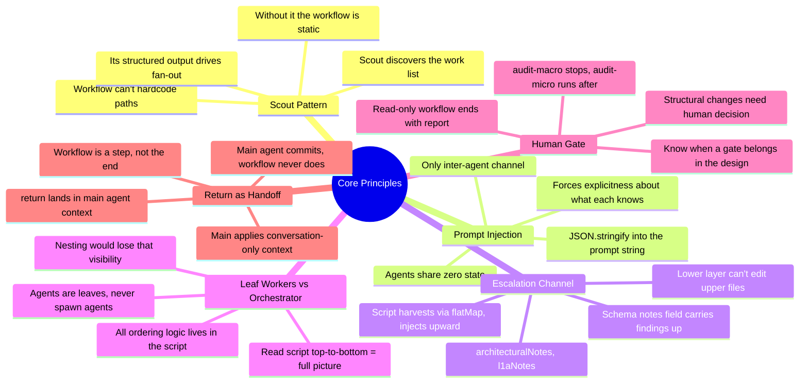

**1. The Scout Pattern.** Almost every workflow starts with a scout. It reads the repo, figures out what's in scope, and returns the structured list the rest of the workflow iterates over. The script can't hardcode paths — the scout makes the workflow adapt to whatever the repo looks like at run time.

**2. Prompt Injection.** Agents share zero state. The only way data moves between them is `JSON.stringify(data)` injected into a prompt string. Limiting on the surface, but it forces you to be explicit about what each agent knows — and that's exactly why schemas matter.

**3. The Escalation Channel.** When a lower-layer agent finds something belonging to a higher layer, it can't edit that file (it's scoped to its own). Instead its schema has a notes field (`architecturalNotes`, `l1aNotes`) for "things the next layer up should know." The script harvests those with `flatMap` and injects them upward.

**4. Leaf Workers vs Orchestrator.** Agents are leaves; the script is the orchestrator. No agent spawns other agents. All "what runs next, with what data" logic lives in the script, so you can read it top to bottom and know exactly what happens.

**5. The Human Gate.** audit-macro ends with a report and an explicit "nothing was applied." Structural changes need a human decision before execution; audit-micro runs only after that gate. Read-only-workflow-ends-with-a-report vs write-workflow-executes is a deliberate design choice.

**6. `return` as the Handoff.** Whatever a workflow returns lands back in the main agent's context. The workflow is a step, not the end — the main agent reads the return, applies anything needing conversation context (like PRODUCT_CONTEXT notes), then commits. Workflows hand off; they don't close the loop.

---

## 6. Model Selection — Which Tier Does What

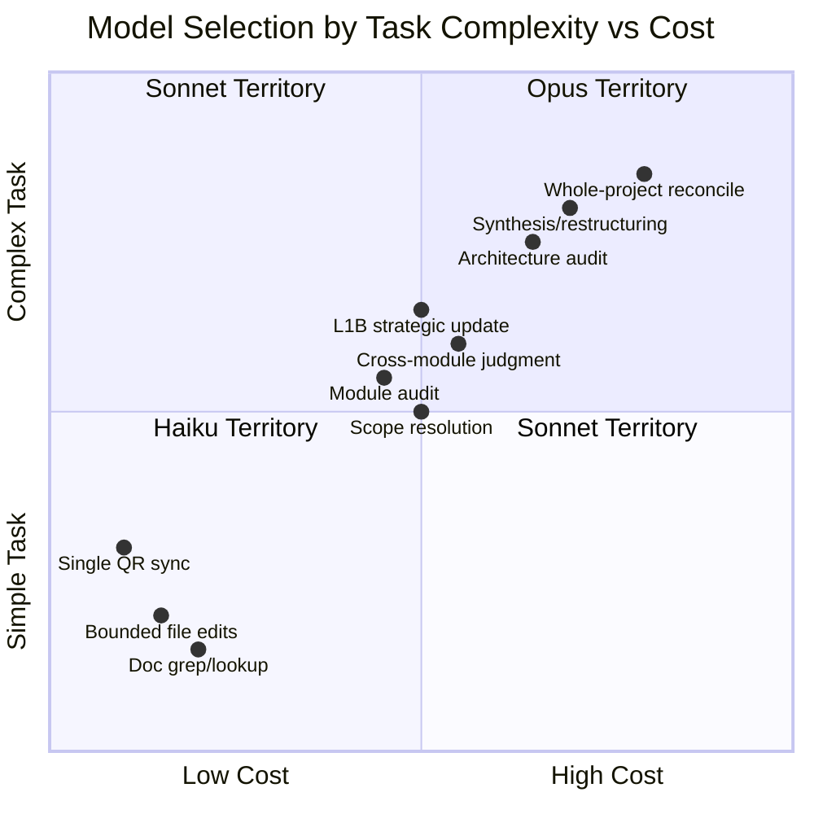

| Model | When to use | Example in doc-sync |
|-------|------------|---------------------|
| **Haiku** | Bounded, mechanical, single-file | QR worker edits one `quick_reference.org` |
| **Sonnet** | Reasoning, medium scope, cross-module | Scout, L1B updates, context reconciler |
| **Opus** | Whole-project, architectural, deep synthesis | L1A root files reconcile |

Set `model:` explicitly on every agent so fan-out workers don't inherit an expensive session model by accident.

---

## 7. doc-sync — Full Execution Map

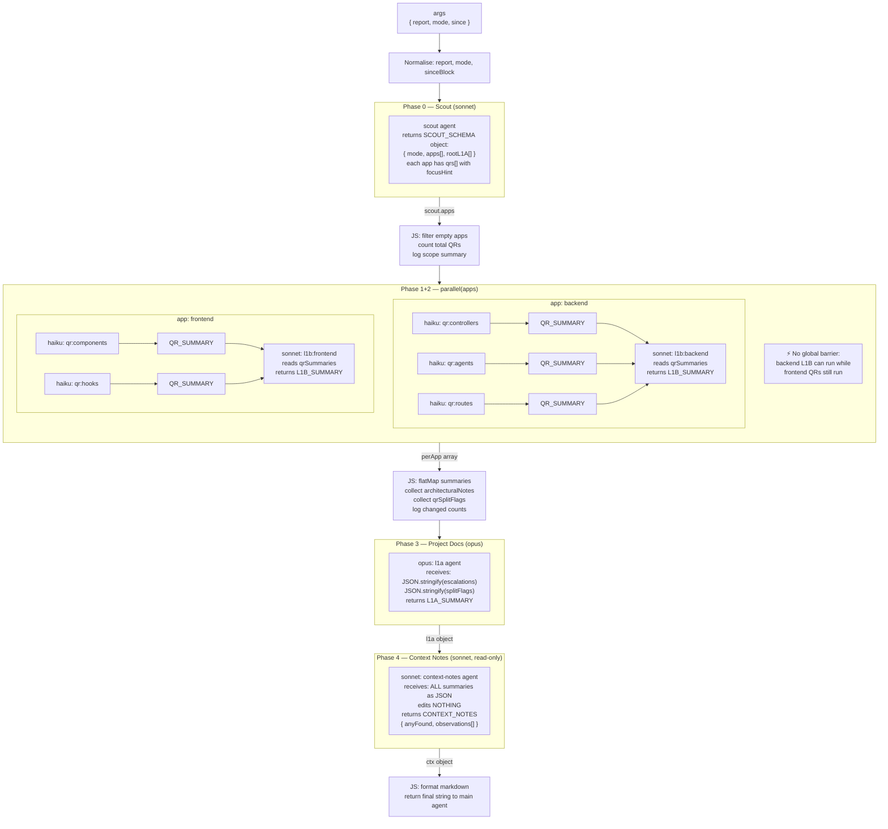

---

## 8. Escalation — How Lower Layers Talk to Upper Layers

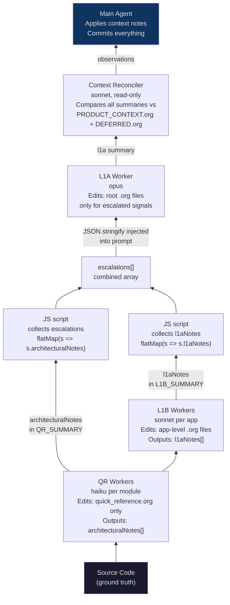

**Key design decision:** workers can only escalate via their schema's notes fields. They cannot edit files outside their scope. The script harvests those notes and injects them into the next layer's prompt. This prevents runaway nesting (agents spawning agents).

---

## 9. audit-macro — Architecture Review Flow

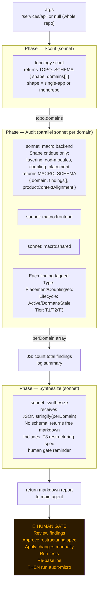

---

## 10. audit-micro — The Adversarial Verify Pattern

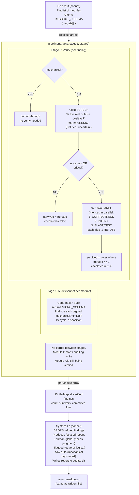

---

## 11. The Adversarial Verify Pattern — Zoomed In

This is the most reusable pattern in the codebase. Use it whenever you need to kill false positives.

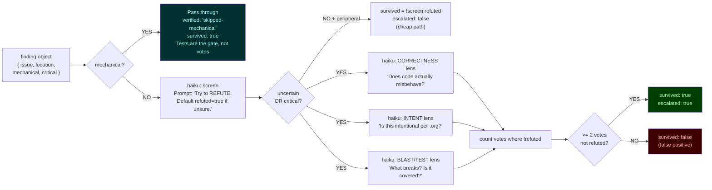

**The adversarial default:** every verifier is prompted to *refute* and defaults to `refuted: true` when uncertain. This biases toward dropping findings rather than surfacing false positives.

---

## 12. The Three Workflows — How They Relate

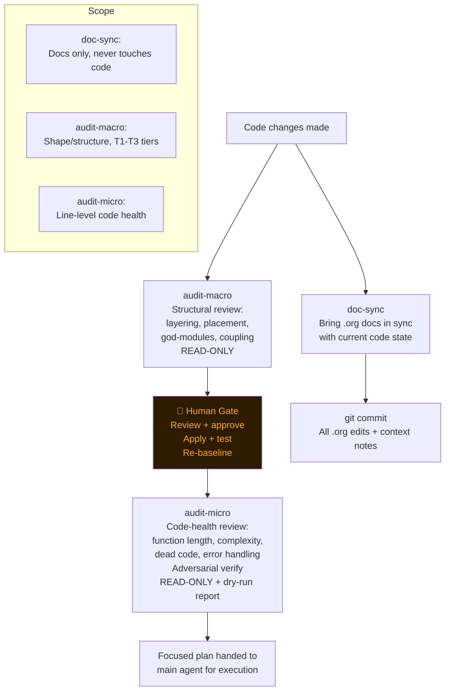

---

## 13. Schema Design — The Contract Between Layers

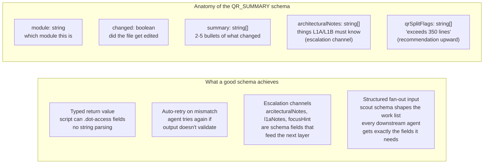

**The pattern:** every schema has a "pass-through" field (the result) and a "next layer" field (escalations/notes). The script harvests escalation fields via `flatMap` and injects them into the next agent's prompt.

---

## 14. Quick Reference — Design Decisions Baked Into These Workflows

| Decision | Why |
|----------|-----|
| Scout always runs first | The script can't hardcode file paths — the scout discovers them dynamically. "Figuring out" lives in the script/scout, not in nested agent nesting. |
| Workers edit only their own file | No write conflicts → no worktree isolation needed. Each QR worker has a single target. |
| Haiku for QR workers | Bounded task (one file, known scope). Saves cost on the widest fan-out. |
| Opus only for L1A | Whole-project reconciliation is the most expensive judgment call. Used once per run. |
| `model:` always explicit | Prevents workers from inheriting an expensive session model (e.g. Opus from parent). |
| `parallel()` inside `parallel()` | Apps run concurrently; QRs inside each app run concurrently. Two levels of fan-out. |
| No global barrier between QR and L1B | Backend L1B doesn't wait for frontend QRs. Wall-clock = slowest app, not sum of all. |
| Context docs never auto-edited | `PRODUCT_CONTEXT.org` / `DEFERRED.org` reflect product decisions, not code state. Only the main agent (who has the conversation context) can update them. |
| Workflow never commits | Commits go through the main agent so the user reviews what lands. |
| `pipeline()` in audit-micro | A module's findings verify immediately when its audit finishes — no waiting for all modules to finish first. |
| Adversarial default = `refuted: true` | Biases toward dropping findings. Better to miss a marginal issue than surface false positives that erode trust in the tool. |

---

## 15. Building Your Own Workflow — Template

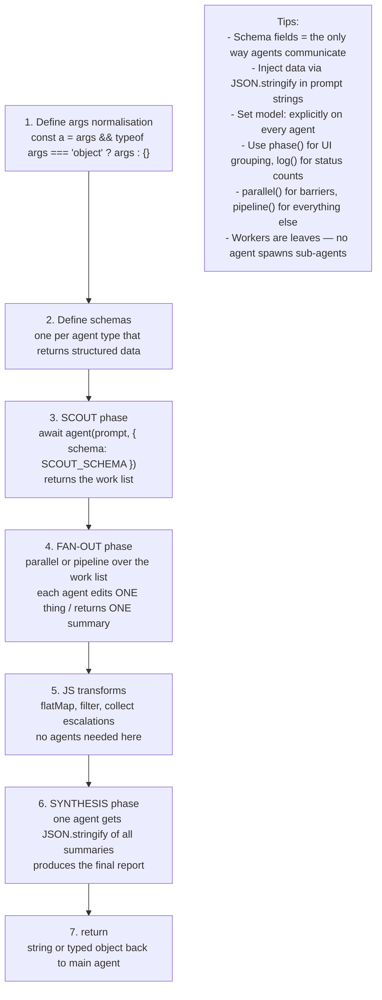
